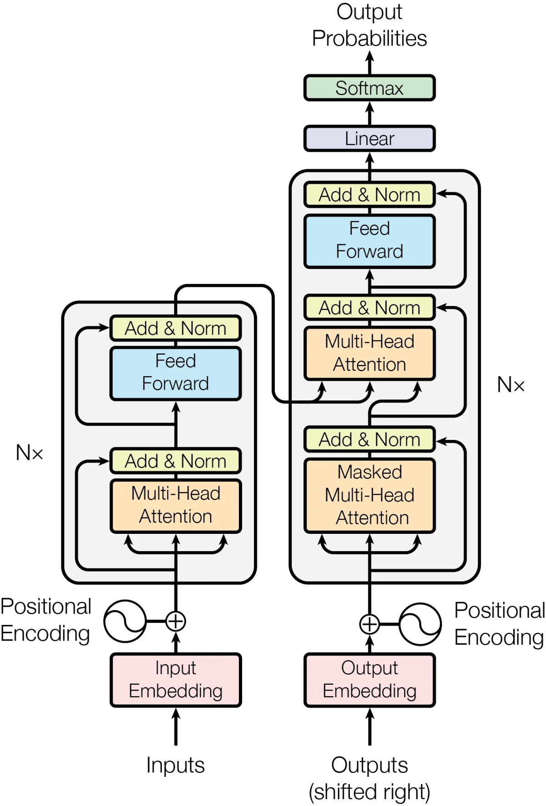

> 이 글은 Ashish Vaswani 외, [*Attention Is All You Need*](https://arxiv.org/abs/1706.03762) (NeurIPS 2017)를 읽고 정리한 요약이다. 본문의 그림과 표는 원 논문에서 가져왔고, 인용한 자리마다 출처를 적었다.

## Background

Transformer 이전에도 Extended Neural GPU, ByteNet, ConvS2S 같은 구조들이 CNN을 기반으로 순차적 계산 과정을 줄이기 위해 등장했지만, 이 구조들은 입력과 출력 요소의 위치가 멀어질수록 필요한 계산량이 늘어나 먼 요소들 사이의 관계를 학습하기 어렵다는 한계가 있었다.

Self-attention은 한 시퀀스 내의 여러 위치 사이의 관계를 통해 그 시퀀스의 representation을 만드는 기법이다.

Transformer는 기존 구조들과 다르게 순서 기반인 RNN이나 convolution을 아예 사용하지 않고 attention만을 사용한 최초의 구조로, 이를 통해 많은 이득을 얻었다.

## Model Architecture

Transformer는 N개의 인코더와 N개의 디코더로 구성되어 있다. 인코더에 input을, 디코더에 output을 임베딩해서 입력하고, 둘 다 Positional Encoding을 더해서 인코더와 디코더에 들어간다.

### Encoder

- Multi-Head Self-Attention
- Residual + Normalization
- Feed Forward(완전 연결망)
- Residual + Normalization

으로 한 개의 Encoder가 구성되어 있다.

### Decoder

- Masked Multi-Head Attention
  - 미래를 보지 않고 예측하기 위해, $i$번째 단어에서는 $i$번까지의 단어끼리의 attention만 계산하는 attention
- Residual + Normalization
- Multi-Head Attention
  - Encoder의 output과 이전 레이어에서 받은 결과로 attention
- Residual + Normalization
- Feed Forward(완전 연결망)
- Residual + Normalization

로 한 개의 Decoder가 구성되어 있다. 그리고 마지막에 Linear 층과 Softmax를 통과해서 확률의 형태로 최종 output을 생성한다.

### Attention

Attention은 Q(쿼리), K(키), V(밸류)를 입력으로 받아서 V의 weighted sum vector를 output으로 생성하는 것으로, 이때 weight는 Q와 K의 유사도를 통해 구해진다.

$$\text{Attention}(Q, K, V) = \text{softmax}\left(\frac{QK^{T}}{\sqrt{d_k}}\right)V$$

$\frac{1}{\sqrt{d_k}}$는 $QK^{T}$의 디멘션이 커질수록 attention의 성능이 낮아지는 현상을 막기 위해 추가되었다.

#### 비유를 통한 이해

- Q는 질문
- K는 사전의 인덱스
- V는 인덱스에 해당하는 실제 값

질문에 해당하는 사전 항목을 찾고($QK^{T}$), 실제 그 항목의 내용을 더한다($\text{softmax}(\cdot)V$).

#### Multi-Head Attention

Multi-Head Attention은 Q, K, V에 Head마다 다른 $W$를 곱한 후에 Attention을 계산하고, 마지막에 모든 Head의 output을 concat한 다음 $W^{O}$를 곱해서 정보를 다시 섞는 과정을 거치는 attention이다.

### Feed Forward Networks

$$\text{FFN}(x) = \max(0,\; xW_1 + b_1)W_2 + b_2$$

### Positional Encoding

- Transformer는 RNN/CNN처럼 순서 정보를 구조적으로 가지지 않기 때문에, **토큰의 위치 정보**를 embedding에 추가한다.
- 각 위치 $pos$마다 $d_{model}$차원의 positional encoding 벡터를 만든다.
- $i = 0$부터 $d_{model}/2 - 1$까지 증가시키며 아래를 계산한다.

$$PE(pos,\, 2i) = \sin\left(\frac{pos}{10000^{2i/d_{model}}}\right), \qquad PE(pos,\, 2i+1) = \cos\left(\frac{pos}{10000^{2i/d_{model}}}\right)$$

- 각 $i$마다 sin, cos 값 2개를 만들기 때문에 총 $d_{model}$차원이 된다.
- 차원마다 서로 다른 주기를 사용하여 각 위치를 서로 구별하기 쉽게 하고, 가까운 거리부터 먼 거리까지 다양한 위치 관계를 표현한다.
- 만들어진 positional encoding은 token embedding에 더한다.

$$X_{input} = Embedding + PositionalEncoding$$

- sin/cos를 사용하면 $pos+k$의 위치 정보를 $pos$의 위치 정보로부터 선형적으로 표현할 수 있어 **상대적 위치 관계도 학습하기 쉽다.**

### Self-Attention

동일 길이의 시퀀스를 다른 동일 길이의 시퀀스로 변환하는 방법들 중 RNN, CNN에 비해 Self-Attention이 갖는 주요한 장점은 아래와 같다.

- **병렬화가 쉽다** — 순서대로 연산할 필요가 없기 때문에 self-attention은 병렬화로 더 빠른 계산이 가능하다.
- **멀리 떨어진 토큰의 관계를 쉽게 학습한다** — maximum path length가 $O(1)$이기 때문에 거리가 먼 토큰과의 관계를 쉽게 학습할 수 있다.
- **일반적인 문장 길이에서 계산량도 유리하다** — 보통 $n < d$이기 때문에 계산 복잡도가 $O(n^2 \cdot d)$인 self-attention이 다른 방법보다 유리하다.

| Layer Type | Complexity per Layer | Sequential Operations | Maximum Path Length |
| --- | --- | --- | --- |
| Self-Attention | $O(n^2 \cdot d)$ | $O(1)$ | $O(1)$ |
| Recurrent | $O(n \cdot d^2)$ | $O(n)$ | $O(n)$ |
| Convolutional | $O(k \cdot n \cdot d^2)$ | $O(1)$ | $O(\log_k n)$ |
| Self-Attention (restricted) | $O(r \cdot n \cdot d)$ | $O(1)$ | $O(n/r)$ |

원 논문 Table 1(Vaswani et al., 2017)을 옮긴 것이다. $n$은 시퀀스 길이, $d$는 representation 차원, $k$는 convolution의 커널 크기, $r$은 restricted self-attention의 이웃 크기다.

추가로, 결과 해석도 self-attention이 더 용이하다.

---

### 참고

- Ashish Vaswani, Noam Shazeer, Niki Parmar, Jakob Uszkoreit, Llion Jones, Aidan N. Gomez, Łukasz Kaiser, Illia Polosukhin, [*Attention Is All You Need*](https://arxiv.org/abs/1706.03762), Advances in Neural Information Processing Systems 30 (NeurIPS 2017), pp. 5998–6008. arXiv:1706.03762 — 이 글이 요약한 원 논문이다. 본문의 구조도는 이 논문의 Figure 1, 복잡도 비교표는 Table 1이다. [PDF](https://arxiv.org/pdf/1706.03762)
