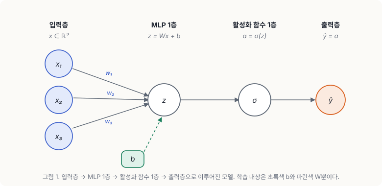
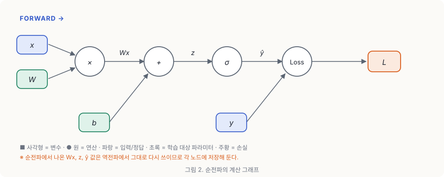
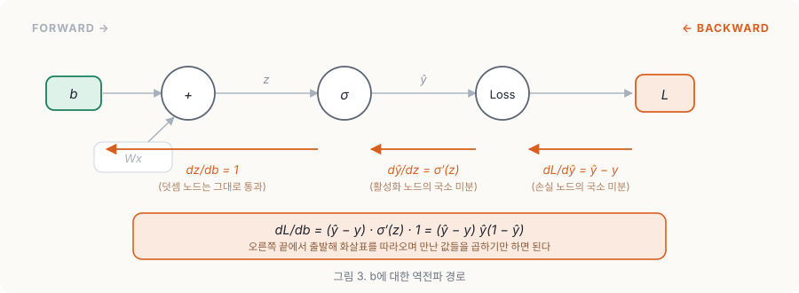
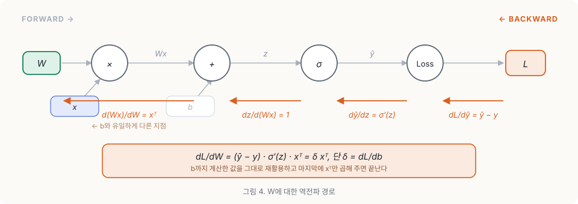

## 순전파
역전파에 대해 알아보기 이전에 순전파에 대해 먼저 알아보자.  
아래 그림처럼 입력층과 MLP 1층, 활성화 함수 1층, 출력층으로 나누어져 있는 모델이 있다고 생각해보자.

이때 입력 값 $x$의 계산 과정을 계산 그래프로 나타내면 아래 그림과 같다. 순전파 과정에서는 각각의 계산 노드에서의 결과를 나중에 역전파에서 다시 쓰기 위해 저장해둔다.

계산 그래프를 따라가며 $x$를 계산하면 최종적으로 모델의 예측값인 $\hat{y}$을 통해 Loss를 얻을 수 있다.
그리고 이때 연산 과정에 참여하는 모델의 가중치 $W$와 바이어스 $b$는 모델이 학습을 진행하면서 최적화 시켜야하는 값이다.
이 파라미터들을 모델이 학습하는 방법은 경사하강법을 통해서 손실 함수를 미분한 값을 이용한다.

## 역전파
이제 본격적으로 역전파의 과정을 알아보자.
먼저 $b$를 학습시키기 위해서는

$$b_{t+1} = b_{t} - \gamma \cdot \frac{dL}{db}$$

를 해야한다.($\gamma$ = 학습률).
이때 $b_t$, $\gamma$는 이미 알려진 값이다. 따라서 위식을 실제로 계산하려면 $\frac{dL}{db}$를 구해야한다. 이때 Chain Rule을 통해 $\frac{dL}{db}$을 구할 수 있다.

### Chain Rule
체인 룰(연쇄 법칙)은 합성 함수의 미분을 각 단계의 미분의 곱으로 쪼개주는 규칙이다. $y = f(u)$이고 $u = g(x)$처럼 $x$가 $u$를 거쳐서 $y$에 영향을 준다면

$$\frac{dy}{dx} = \frac{dy}{du} \cdot \frac{du}{dx}$$

가 성립한다. 직관적으로 보면 이렇다. $x$를 아주 조금 흔들었을 때 $u$가 얼마나 흔들리는지($\frac{du}{dx}$), 그리고 그 흔들림이 다시 $y$를 얼마나 흔드는지($\frac{dy}{du}$)를 곱해주면 결국 $x$가 $y$를 얼마나 흔들었는지가 나온다는 것이다.

그런데 신경망은 결국 선형 변환 → 활성화 함수 → 손실 함수를 계속 겹쳐 놓은 거대한 합성 함수다. 그래서 층이 아무리 깊어져도 맨 뒤의 Loss에서 출발해 각 파라미터까지 미분을 하나씩 이어 붙일 수 있다. 이게 역전파의 전부다.

### b 학습
체인룰을 $\frac{dL}{db}$에 적용시켜보면

$$\frac{dL}{db} = \frac{dL}{d\hat{y}} \cdot \frac{d\hat{y}}{db}$$

가 나오고 이제 두 항을 각각 계산하면 된다. 계산을 구체적으로 해보기 위해 각 노드를 아래처럼 두자.

$$z = Wx + b, \qquad \hat{y} = \sigma(z), \qquad L = \frac{1}{2}(\hat{y} - y)^2$$

여기서 $\sigma$는 시그모이드 함수이고, $L$은 MSE(제곱 오차)다.

먼저 $\frac{dL}{d\hat{y}}$부터 보자. $L$은 $\hat{y}$에 대한 이차식이므로 그냥 미분하면 된다.

$$\frac{dL}{d\hat{y}} = \frac{d}{d\hat{y}} \left[ \frac{1}{2}(\hat{y} - y)^2 \right] = \hat{y} - y$$

예측값에서 정답을 뺀 값, 즉 **오차** 그 자체가 나온다. 손실 함수 앞에 $\frac{1}{2}$을 붙여둔 이유가 바로 이것 때문이다.

다음으로 $\frac{d\hat{y}}{db}$를 보자. $b$는 $\hat{y}$에 직접 들어가는 게 아니라 $z$를 거쳐서 들어가므로, 여기에도 체인 룰을 한 번 더 적용한다.

$$\frac{d\hat{y}}{db} = \frac{d\hat{y}}{dz} \cdot \frac{dz}{db}$$

$\hat{y} = \sigma(z)$이므로 $\frac{d\hat{y}}{dz} = \sigma'(z)$이고, 시그모이드의 미분은 $\sigma'(z) = \sigma(z)(1 - \sigma(z)) = \hat{y}(1 - \hat{y})$라는 성질이 있다. 순전파 때 저장해둔 $\hat{y}$만 있으면 바로 구할 수 있다는 뜻이다.
그리고 $z = Wx + b$를 $b$로 미분하면 $Wx$는 $b$와 무관하므로

$$\frac{dz}{db} = 1$$

이 된다. 덧셈 노드는 미분값을 아무 변형 없이 그대로 흘려보낸다고 이해하면 편하다. 따라서

$$\frac{d\hat{y}}{db} = \hat{y}(1 - \hat{y}) \cdot 1 = \hat{y}(1 - \hat{y})$$

이고, 두 항을 합치면 최종적으로

$$\frac{dL}{db} = (\hat{y} - y) \cdot \hat{y}(1 - \hat{y})$$

를 얻는다. 우변에 등장하는 값은 $\hat{y}$와 $y$뿐이다. 순전파에서 이미 다 계산해둔 값들이므로 새로 계산할 것이 하나도 없다. 이제 이 값을 맨 처음 식에 넣어주면 $b$가 한 스텝 업데이트된다.

그림에서 보이듯 역전파는 오른쪽 끝 $L$에서 출발해 화살표를 거꾸로 따라오면서, 각 노드가 가진 미분값을 하나씩 곱해 나가는 과정일 뿐이다.

### W 학습
W도 b와 같은 과정을 통해 미분하면 아래와 같은 과정을 거치게 된다.

$$\frac{dL}{dW} = \frac{dL}{d\hat{y}} \cdot \frac{d\hat{y}}{dz} \cdot \frac{dz}{dW}$$

앞의 두 항은 $b$를 구할 때 이미 계산했다. 그대로 가져오면 된다.

$$\frac{dL}{d\hat{y}} = \hat{y} - y, \qquad \frac{d\hat{y}}{dz} = \hat{y}(1 - \hat{y})$$

달라지는 건 마지막 항 하나뿐이다. $z = Wx + b$를 $W$로 미분하면 이번엔 $b$가 상수 취급을 받고 $x$가 남는다.

$$\frac{dz}{dW} = x^{\top}$$

전치 기호가 붙는 이유는 모양을 맞춰주기 위해서다. $W$가 $1 \times d$ 행렬이면 $\frac{dL}{dW}$도 $1 \times d$가 되어야 하는데, 스칼라에 $x \in \mathbb{R}^{d}$를 그냥 곱하면 $d \times 1$이 나오기 때문이다. 결국 세 항을 모두 곱하면

$$\frac{dL}{dW} = (\hat{y} - y) \cdot \hat{y}(1 - \hat{y}) \cdot x^{\top}$$

가 된다. 여기서 앞의 두 항을 하나로 묶어 $\delta = (\hat{y} - y)\hat{y}(1 - \hat{y})$라고 두면

$$\frac{dL}{db} = \delta, \qquad \frac{dL}{dW} = \delta x^{\top}$$

로 아주 깔끔하게 정리된다. 즉 $b$의 그래디언트를 구해두면 $W$의 그래디언트는 $x^{\top}$만 한 번 더 곱하면 끝이다. 역전파가 "빠른" 이유가 여기에 있다. 같은 층을 지나는 파라미터들이 **공통 경로의 계산 결과를 전부 재사용**하기 때문이다.

그리고 $W$도 $b$와 똑같이 업데이트해주면 된다.

$$W_{t+1} = W_{t} - \gamma \cdot \frac{dL}{dW}$$

## 결론
이렇게 연쇄 법칙을 통해 모델의 파라미터들을 학습할 수 있다!
