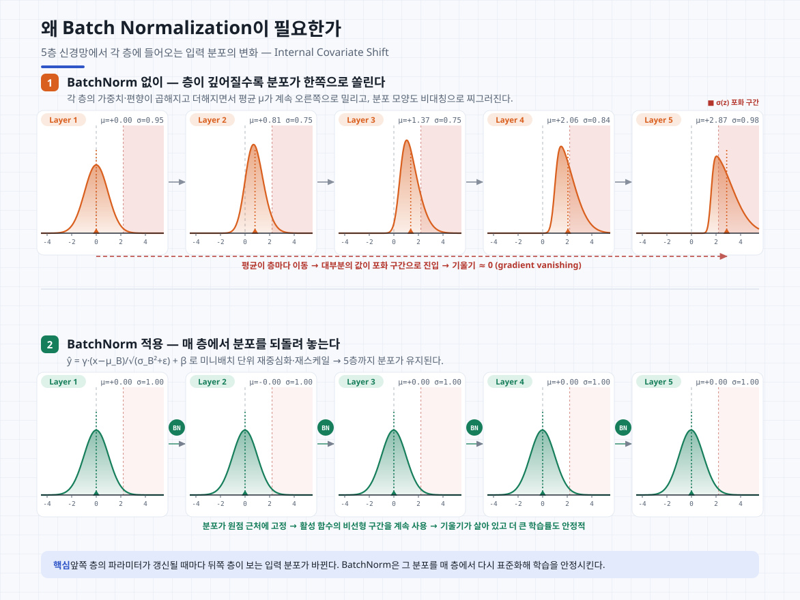

## Batch Normalization

배치 노말라이제이션의 핵심은 각 레이어에 들어오는 입력을 노말라이제이션하는 과정이다. 근데, 왜 레이어에 들어오는 입력을 노말라이제이션을 해야할까?

일반적으로 모델을 학습할 때를 생각해보면 모델에 들어오는 입력이 각 Batch마다 비슷한 경우가 많다, 즉 입력의 분포가 어느정도 일정하게 유지가 된다는 뜻인데, 이게 깊은 레이어에서도 동일하게 유지가 될까?



이 사진을 보면 batch normalization이 적용되지 않았을 때에는 뒤로 갈수록 분포가 더 한쪽으로 쏠리는 현상을 볼 수 있다. 그리고 이때 sigmoid 같은 활성화 함수를 사용한다면 미분값이 0에 가까워지며 vanishing gradient 현상이 일어나면서 모델의 학습 자체가 느려지거나 멈출 수 있다.

이런 현상들을 막기 위해 층마다 입력 값의 분포를 되돌려 놓는 Batch Normalization이 사용되고 있다.

### 계산 과정

Batch Normalization은 미니배치 $\mathcal{B} = \{x_1, \dots, x_m\}$에 대해 평균 $\mu_\mathcal{B}$와 분산 $\sigma_\mathcal{B}^2$을 구하고, 그 값으로 표준화를 한 이후, 표준화된 값에 $\gamma$를 곱하고 $\beta$를 더하는 과정을 통해 출력을 만든다.

$$\mu_\mathcal{B} = \frac{1}{m}\sum_{i=1}^{m} x_i, \qquad \sigma_\mathcal{B}^2 = \frac{1}{m}\sum_{i=1}^{m}(x_i - \mu_\mathcal{B})^2$$

$$\hat{x}_i = \frac{x_i - \mu_\mathcal{B}}{\sqrt{\sigma_\mathcal{B}^2 + \epsilon}}, \qquad y_i = \gamma\,\hat{x}_i + \beta$$

여기서 분모는 분산이 아니라 **표준편차**, 즉 $\sqrt{\sigma_\mathcal{B}^2 + \epsilon}$이다. 분산으로 나누면 스케일 차원이 맞지 않아 표준화가 되지 않는다. $\epsilon$은 분산이 0에 가까울 때 0으로 나누는 것을 막는 작은 상수다(PyTorch 기본값 `1e-5`).

그리고 이 통계량은 **특성(feature) 차원마다 따로** 계산한다. 입력이 $(m, d)$ 모양이면 배치 축 $m$을 따라 평균을 내므로 $\mu_\mathcal{B}, \sigma_\mathcal{B}^2, \gamma, \beta$는 모두 길이 $d$짜리 벡터다. 즉 "배치 안의 서로 다른 샘플들끼리" 비교해서 각 특성을 표준화하는 것이지, 한 샘플 안의 특성들끼리 표준화하는 게 아니다. (한 샘플 안에서 표준화하는 건 Layer Normalization이다.)

### 왜 표준화 이후에 다시 Linear Transform을 하는가

표준화만 하고 끝내면 그 층의 출력은 **항상** 평균 0, 분산 1로 강제된다. 이건 그 층이 표현할 수 있는 함수의 집합을 좁히는 제약이다. 예를 들어 sigmoid 앞에 BN을 넣으면 입력이 늘 0 근처에 모이는데, sigmoid는 0 근처에서 거의 선형이다. 비선형성을 쓰려고 활성화 함수를 넣었는데 정작 비선형 구간을 못 쓰게 되는 셈이다.

$\gamma$와 $\beta$는 이 제약을 풀어주는 장치다. 네트워크가 원한다면 $\gamma = \sqrt{\sigma_\mathcal{B}^2 + \epsilon}$, $\beta = \mu_\mathcal{B}$를 학습해서 정규화를 완전히 되돌리는 항등변환까지 만들 수 있다. 즉 "정규화를 얼마나 할지"를 고정된 규칙으로 못 박는 대신 **학습이 결정하게** 만든 것이다.

> **덧붙임 — ICS는 정말 원인일까**
> 위에서 설명한 internal covariate shift는 BN 원 논문(Ioffe & Szegedy, 2015)이 제시한 설명이다. 다만 이후 Santurkar et al. (2018)은 BN이 ICS를 실제로 줄이지 않는 상황에서도 학습이 빨라진다는 것을 보이며, BN의 효과는 오히려 **손실 지형(loss landscape)을 매끄럽게 만들어 더 큰 학습률을 안정적으로 쓸 수 있게 해주는 데** 있다고 주장했다. "왜 잘 되는지"는 아직 완전히 정리된 문제가 아니다.

## Moving Average

Batch Normalization은 두 가지 학습이 필요한 파라미터를 가지고 있다. 표준화된 값에 곱해지는 $\gamma$(scale)와 더해지는 $\beta$(shift)다. 곱해지는 $\gamma$가 출력의 표준편차를, 더해지는 $\beta$가 출력의 평균을 결정하는 역할을 한다. 이 둘은 히든 레이어의 가중치들처럼 back propagation을 통해 학습할 수 있다.

주의할 점은 $\gamma$, $\beta$가 입력의 평균·분산 그 자체가 **아니라는** 것이다. 입력의 평균 $\mu_\mathcal{B}$와 분산 $\sigma_\mathcal{B}^2$는 매 미니배치마다 데이터에서 계산되는 값이고, $\gamma$와 $\beta$는 그것과 독립적으로 학습되는 파라미터다.

그런데 batch normalization 과정을 잘 살펴보면 입력의 평균 $\mu_\mathcal{B}$와 분산 $\sigma_\mathcal{B}^2$를 구해서 표준화를 하는데, 학습이 아닌 추론 단계에서는 이 값을 어떻게 구할 수 있을까? 추론은 샘플 하나에 대해서도 이루어져야 하는데, 배치 크기가 1이면 분산이 0이 되어 계산 자체가 불가능하다. 게다가 같은 샘플이라도 어떤 샘플들과 같은 배치에 묶이느냐에 따라 출력이 달라진다면 예측이 결정적이지 않게 된다.

정답은 학습 과정에서 본 입력 전체의 평균과 분산을 추정해두고 그것을 고정해서 사용한다. 그런데 그렇다면 한 미니 배치를 학습할 때마다 그 평균과 분산을 전부 기억해야 할까? 그러면 너무 비효율적이다. 대신 Moving Average를 사용하면 값 하나만 메모리에 둔 채로 입력 전체의 평균과 분산을 근사할 수 있다.

### 식 1 — 누적 평균의 재귀 형태

먼저 $n$번째 미니배치까지의 단순 누적 평균을 생각해보자. 각 배치의 평균을 $\mu_1, \mu_2, \dots, \mu_n$이라 하면

$$\bar{\mu}_n = \frac{1}{n}\sum_{i=1}^{n}\mu_i$$

이 식을 그대로 쓰려면 $\mu_1$부터 $\mu_n$까지 전부 들고 있어야 한다. 그런데 양변에 $n$을 곱해서 정리하면

$$n\,\bar{\mu}_n = \sum_{i=1}^{n-1}\mu_i + \mu_n = (n-1)\,\bar{\mu}_{n-1} + \mu_n$$

$$\bar{\mu}_n = \frac{(n-1)\bar{\mu}_{n-1} + \mu_n}{n} = \bar{\mu}_{n-1} + \frac{1}{n}\left(\mu_n - \bar{\mu}_{n-1}\right)$$

**직전 추정값 + 보정항** 형태가 나온다. 이제 과거 배치들을 기억할 필요 없이 $\bar{\mu}_{n-1}$ 하나와 현재 배치의 $\mu_n$만 있으면 갱신할 수 있다. 이게 moving average의 출발점이다.

### 식 2 — 지수 이동 평균 (평균)

식 1을 그대로 쓰면 문제가 하나 있다. 보정항의 계수 $1/n$이 학습이 진행될수록 0에 수렴해서, 나중 배치들이 추정값에 거의 영향을 주지 못한다. 그런데 학습 초기의 파라미터와 후기의 파라미터는 완전히 다르고, 우리가 추론에서 쓰고 싶은 건 **학습이 끝난 시점의 네트워크가 만들어내는 분포**다. 초기 배치의 통계량은 오히려 방해가 된다.

그래서 $1/n$ 대신 고정된 상수 $\alpha \in (0, 1)$를 쓴다.

$$\hat{\mu}_n = \hat{\mu}_{n-1} + \alpha\left(\mu_n - \hat{\mu}_{n-1}\right) = (1-\alpha)\,\hat{\mu}_{n-1} + \alpha\,\mu_n$$

이것이 **지수 이동 평균(Exponential Moving Average)**이다. 왜 "지수"인지는 재귀를 풀어보면 보인다.

$$\hat{\mu}_n = \alpha\sum_{k=0}^{n-1}(1-\alpha)^{k}\,\mu_{n-k} + (1-\alpha)^{n}\hat{\mu}_0$$

$\mu_{n-k}$에 붙은 가중치가 $\alpha(1-\alpha)^k$로, $k$가 커질수록(과거로 갈수록) **지수적으로 감소**한다. 가중치의 합은 등비급수라서

$$\alpha\sum_{k=0}^{n-1}(1-\alpha)^{k} = \alpha \cdot \frac{1-(1-\alpha)^n}{\alpha} = 1 - (1-\alpha)^n \;\xrightarrow{\;n\to\infty\;}\; 1$$

이 되어 정상적인 가중평균이 된다. 그리고 초기값 $\hat{\mu}_0$(보통 0)의 영향은 $(1-\alpha)^n$으로 지수적으로 사라진다. 배치 수가 충분하면 초기값을 뭘로 두든 상관없다는 뜻이다.

### 식 3 — 지수 이동 평균 (분산)

분산도 똑같은 규칙으로 갱신한다.

$$\hat{\sigma}^2_n = (1-\alpha)\,\hat{\sigma}^2_{n-1} + \alpha\,\sigma^2_{\mathcal{B},n}$$

그래서 추론 단계에서는 학습 중 갱신해둔 $\hat{\mu}$, $\hat{\sigma}^2$를 상수로 고정해 쓴다.

$$y = \gamma \cdot \frac{x - \hat{\mu}}{\sqrt{\hat{\sigma}^2 + \epsilon}} + \beta$$

이렇게 하면 추론 시 BN은 입력에 대한 단순한 affine 변환이 되고, 앞뒤 층과 하나로 합쳐버릴 수도 있다(BN folding). 배치 크기와 무관하게 결정적인 출력이 나온다는 점도 중요하다.

> **PyTorch 구현 디테일 두 가지**
>
> **1. `momentum` 인자는 $1-\alpha$가 아니라 $\alpha$다.** `nn.BatchNorm1d(num_features, momentum=0.1)`에서 0.1은 **새 배치 통계에 주는 가중치**다.
> ```
> running_mean = (1 - momentum) * running_mean + momentum * batch_mean
> ```
> TensorFlow/Keras는 반대 관례를 써서 `momentum=0.99`가 PyTorch의 `momentum=0.01`에 해당한다. 두 프레임워크 사이에서 코드를 옮길 때 자주 틀리는 부분이다. `momentum=None`으로 두면 식 1의 단순 누적 평균을 쓴다.
>
> **2. 표준화에 쓰는 분산과 running stat에 쌓는 분산이 다르다.** 현재 배치를 표준화할 때는 편향 분산($\frac{1}{m}\sum$)을 쓰지만, `running_var`에 누적할 때는 **불편 분산**($\frac{1}{m-1}\sum$)을 쓴다. 미니배치 분산은 전체 분산을 과소추정하기 때문에 $\frac{m}{m-1}$ 보정을 넣는 것으로, 원 논문의 $\mathrm{Var}[x] = \frac{m}{m-1}\,\mathbb{E}_\mathcal{B}[\sigma_\mathcal{B}^2]$에 대응한다.

## 실사용

Batch Normalization layer는 **완전연결층이나 합성곱층의 출력 직후, 활성화 함수 직전**에 붙여서 사용한다. 즉 `Input -> Linear -> BatchNorm -> ReLU -> Linear -> BatchNorm -> ReLU -> Output` 형태다. 정규화의 목적이 활성화 함수에 들어가는 값의 분포를 조절하는 것이므로, 활성화 함수 뒤가 아니라 앞에 놓아야 한다.

### MLP

```python
import torch.nn as nn

net = nn.Sequential(
    nn.Flatten(),
    nn.Linear(784, 256, bias=False),   # 편향은 BN의 β가 대신하므로 불필요
    nn.BatchNorm1d(256),
    nn.ReLU(),
    nn.Linear(256, 128, bias=False),
    nn.BatchNorm1d(128),
    nn.ReLU(),
    nn.Linear(128, 10),                # 출력층에는 BN을 넣지 않는다
)
```

`bias=False`로 두는 이유는, BN이 입력에서 평균 $\mu_\mathcal{B}$를 빼는 순간 직전 층의 편향 $b$가 그대로 상쇄되기 때문이다. $\mathbf{Wx} + b$에서 $b$는 배치 평균에도 똑같이 더해지므로 $(\mathbf{Wx}+b) - (\mu + b) = \mathbf{Wx} - \mu$가 되어 흔적이 남지 않는다. 어차피 $\beta$가 편향 역할을 하니 파라미터를 낭비할 이유가 없다.

### CNN

합성곱층에서는 `BatchNorm2d`를 쓴다. 입력이 $(N, C, H, W)$일 때 채널 축 $C$를 제외한 나머지 축 전체($N \times H \times W$개 값)에 대해 통계를 낸다. 같은 채널의 픽셀들은 같은 커널이 만들어낸 값이니 하나의 "특성"으로 취급하는 것이다. 따라서 학습 파라미터는 채널 수만큼, 즉 $\gamma, \beta$ 각각 $C$개다.

```python
# BN을 적용한 LeNet
net = nn.Sequential(
    nn.Conv2d(1, 6, kernel_size=5, bias=False),
    nn.BatchNorm2d(6), nn.Sigmoid(),
    nn.AvgPool2d(kernel_size=2, stride=2),

    nn.Conv2d(6, 16, kernel_size=5, bias=False),
    nn.BatchNorm2d(16), nn.Sigmoid(),
    nn.AvgPool2d(kernel_size=2, stride=2),

    nn.Flatten(),
    nn.Linear(16 * 5 * 5, 120, bias=False),
    nn.BatchNorm1d(120), nn.Sigmoid(),
    nn.Linear(120, 84, bias=False),
    nn.BatchNorm1d(84), nn.Sigmoid(),
    nn.Linear(84, 10),
)
```

### Residual Block

ResNet의 잔차 블록은 BN 배치의 대표적인 예다. 마지막 ReLU는 skip connection을 더한 **뒤에** 온다.

```python
class Residual(nn.Module):
    def __init__(self, in_ch, out_ch, stride=1):
        super().__init__()
        self.conv1 = nn.Conv2d(in_ch, out_ch, 3, stride=stride, padding=1, bias=False)
        self.bn1 = nn.BatchNorm2d(out_ch)
        self.conv2 = nn.Conv2d(out_ch, out_ch, 3, padding=1, bias=False)
        self.bn2 = nn.BatchNorm2d(out_ch)
        self.relu = nn.ReLU(inplace=True)

        self.shortcut = nn.Sequential()
        if stride != 1 or in_ch != out_ch:
            self.shortcut = nn.Sequential(
                nn.Conv2d(in_ch, out_ch, 1, stride=stride, bias=False),
                nn.BatchNorm2d(out_ch),
            )

    def forward(self, x):
        out = self.relu(self.bn1(self.conv1(x)))   # conv -> BN -> ReLU
        out = self.bn2(self.conv2(out))            # conv -> BN
        out = out + self.shortcut(x)               # skip connection
        return self.relu(out)                      # 더한 뒤에 ReLU
```

### 학습 모드와 추론 모드

BN은 학습과 추론에서 **동작이 다른** 층이다. 학습 중에는 현재 미니배치의 통계량을 쓰고 running stat을 갱신하지만, 추론에서는 저장된 running stat을 쓰고 갱신하지 않는다. 이 전환은 `model.train()` / `model.eval()`이 담당한다.

```python
model.train()   # 배치 통계 사용 + running stat 갱신
...
model.eval()    # running stat 사용, 갱신 없음
with torch.no_grad():
    preds = model(x)
```

`model.eval()`을 빠뜨리면 검증 성능이 이상하게 나오거나, 배치 구성에 따라 예측이 흔들린다. Dropout도 같은 이유로 모드에 따라 동작이 달라지므로, 이 호출은 습관처럼 붙여두는 게 좋다.

### 배치 크기에 대한 의존성

BN은 미니배치의 통계량에 의존하므로 배치가 작으면 $\mu_\mathcal{B}$, $\sigma_\mathcal{B}^2$의 추정이 불안정해진다. 배치 크기가 1이면 표준화 결과가 항상 0이 되어 아예 동작하지 않는다. 검출·분할처럼 메모리 때문에 배치를 크게 못 잡는 작업이나, 시퀀스 길이가 들쭉날쭉한 RNN/Transformer 계열에서 BN 대신 Layer Normalization이나 Group Normalization을 쓰는 이유가 여기에 있다.

### Dropout과 함께 쓰지 않는 이유

BN도 regularization의 역할을 하기 때문에 batch normalization과 dropout을 동시에 사용하지 않는 경우가 많다. BN이 정규화 효과를 갖는 건 미니배치가 어떻게 구성되느냐에 따라 $\mu_\mathcal{B}$, $\sigma_\mathcal{B}^2$가 조금씩 흔들리고, 그 잡음이 같은 샘플에 매번 다른 출력을 만들어내기 때문이다.

둘을 같이 쓰면 오히려 성능이 나빠질 수 있다. Dropout은 학습 때와 추론 때 출력의 **분산**이 달라지는데, BN의 running stat은 학습 시점의 분산을 기준으로 쌓이므로 추론에서 통계량이 어긋나게 된다(Li et al., 2019이 "variance shift"라고 부른 현상이다). 그래서 ResNet 이후의 CNN 아키텍처들은 합성곱 부분에서 dropout을 아예 빼는 쪽으로 정리됐고, 굳이 함께 쓴다면 모든 BN 층보다 뒤쪽, 보통 마지막 분류기 직전에만 넣는다.

---

### 참고

- Sergey Ioffe, Christian Szegedy, [*Batch Normalization: Accelerating Deep Network Training by Reducing Internal Covariate Shift*](https://arxiv.org/abs/1502.03167), ICML 2015 — BN 원 논문. ICS 개념과 추론 시 $\frac{m}{m-1}$ 보정이 여기서 나온다.
- Shibani Santurkar, Dimitris Tsipras, Andrew Ilyas, Aleksander Madry, [*How Does Batch Normalization Help Optimization?*](https://arxiv.org/abs/1805.11604), NeurIPS 2018 — 초판 제목이 "(No, It Is Not About Internal Covariate Shift)"였다. BN의 효과가 ICS 감소가 아니라 손실 지형의 평활화에서 온다는 주장.
- Xiang Li, Shuo Chen, Xiaolin Hu, Jian Yang, [*Understanding the Disharmony between Dropout and Batch Normalization by Variance Shift*](https://arxiv.org/abs/1801.05134), CVPR 2019 — dropout과 BN을 같이 쓰면 왜 나빠지는지에 대한 분석.
- [*Dive into Deep Learning*, 8.5 Batch Normalization](https://d2l.ai/chapter_convolutional-modern/batch-norm.html) — 밑바닥 구현과 BN을 적용한 LeNet 예제.
- [PyTorch `nn.BatchNorm1d` 문서](https://docs.pytorch.org/docs/stable/generated/torch.nn.BatchNorm1d.html) / [`nn.BatchNorm2d` 문서](https://docs.pytorch.org/docs/stable/generated/torch.nn.BatchNorm2d.html) — `momentum` 관례와 편향/불편 분산 처리에 대한 설명.